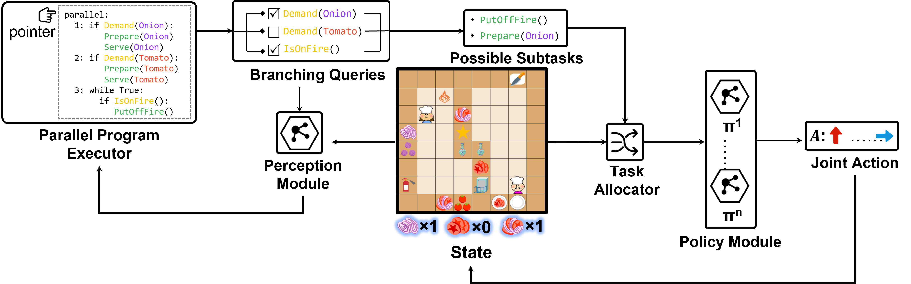

# E-MAPP
This is the official repository for the paper: **E-MAPP: Efficient Multi-Agent Reinforcement Learning with Parallel Program Guidance**.[[Project page](https://sites.google.com/view/e-mapp)]


## Setup the env
```
pip install -r requirements.txt
```

## Dataset
Examplary programs are provided in the ```program``` directory. You can also add your own programs following the grammar.
You can generate different overcooked scenes as well as the guiding programs with ```scene_generation.py```
Exemplary program and scene description can be found at ```levels/mamt```.

## Training
There are sevel stages in training the whole e-mapp framework.
1. train the *single agent single subtask policy*
``` bash scripts/train_sast.sh```
2. train the *perception module*
``` bash scripts/train_perception.sh```
3. train the *rechability function*
``` bash scripts/train_reach.sh```
4. train cooperative policies 
``` bash scripts/train_cooperation.sh```
5. train the feasibility function
``` bash scripts/train_feas.sh``` 
6. evaluate the complete e-mapp 
``` bash scripts/evaluate.sh```

## References
The code is built upon
- [[Stable Baselines3](https://github.com/DLR-RM/stable-baselines3)]
- [[Overcooked Env](https://github.com/rosewang2008/gym-cooking)]

## Citation
If you find this code helpful, please consider citing:
```
@inproceedings{changmapp,
  title={E-MAPP: Efficient Multi-Agent Reinforcement Learning with Parallel Program Guidance},
  author={Chang, Can and Mu, Ni and Wu, Jiajun and Pan, Ling and Xu, Huazhe},
  booktitle={Advances in Neural Information Processing Systems}
}
```